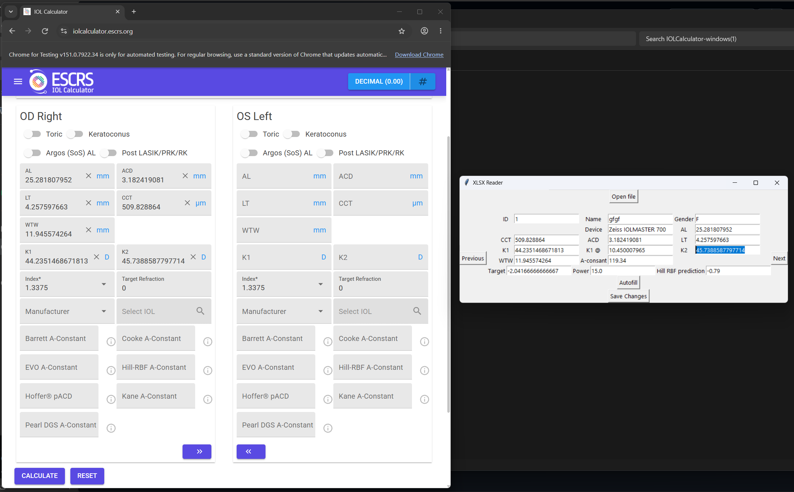

# IOL Calculator Automation

Browser automation to make it easier to write into the IOL calculator provided by [ESCRS](https://iolcalculator.escrs.org/). This is NOT a fully featured IOL calculator; the only intention is to make it easier for clinical researchers to bring their excel sheets and easily automate the process of making the calculations, instead of manually having to type out each calculation.

## Steps

1. Run the executable. The reader window and Chrome both open on their own.
2. Click **Open file** and pick your `.xlsx` sheet.
3. Use **Previous** and **Next** to move between rows.
4. Click **Autofill** to type the current row into the ESCRS form.
5. Complete the CAPTCHA yourself and submit on the website. The autofill does not do this for you.
6. Type the results into the boxes at the top, then click **Save Changes**.

## Your spreadsheet

One row per eye. Columns are matched by name: `Name`, `Target`, `AL`, `CCT`, `ACD`, `LT`, `K1`, `K2`, `WTW`, `A-consant`, `Pearl-A`.

Note the spelling of `A-consant`, and that **Save Changes** overwrites your original file in place, so work on a copy.

`data/sample_cases.xlsx` is made-up data for testing. There is no real patient data in this repo.

## Requirements

Google Chrome must be installed, and the machine needs internet on first run. Running from source instead of the executable needs Python 3.9+ and `pip install -r requirements.txt`.

## Notes

`Gender` and `Device` are read from the sheet but not yet filled in. The surgeon name is hardcoded. Only Chrome is supported.

## Status

<!-- TODO: I write this myself -->
